# 手把手教你发行自己的加密货币-ETH
## 关键字：ETH,加密货币,发行,智能合约

## 本教程准备：
1、会魔法上网（科学上网 爬梯子），这里不懂的话建议直接关闭本教程。（必须）
2、需要一个以太坊钱包，这里推荐MetaMask。（必须）

### 可能用到的工具与技术、资源：
编辑器：https://remix.ethereum.org  
Metamask钱包：https://metamask.io  
以太坊测试币获取地址：https://faucet.metamask.io  
智能合约以太坊代码：https://github.com/duduzixun/dapp/blob/main/dapp-coin/contract1/contracts/eip20/EIP20.sol  

## 核心操作步骤：
### 1、打开编辑器：https://remix.ethereum.org  
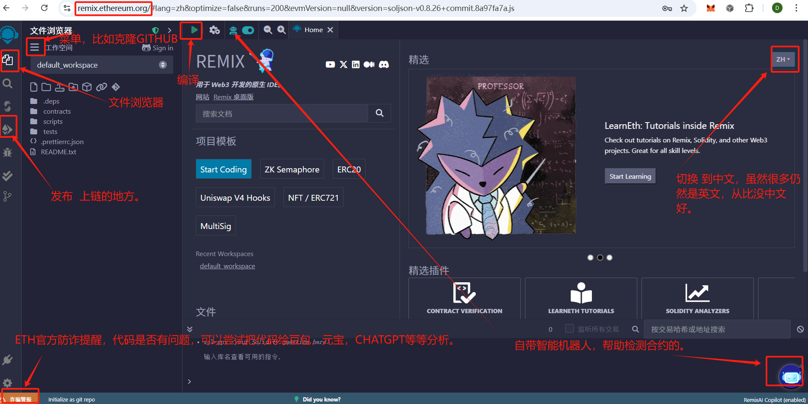

### 2、克隆代码
    选择左上角 汉堡 图标，选择“文件”，选择“打开文件”，选择“克隆”，
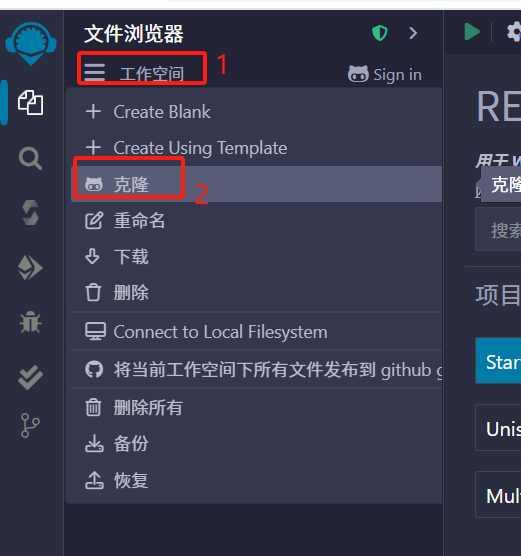
选择“克隆URL”，输入以下地址：https://github.com/duduzixun/contracts-ETH.git  

克隆成功的结构：
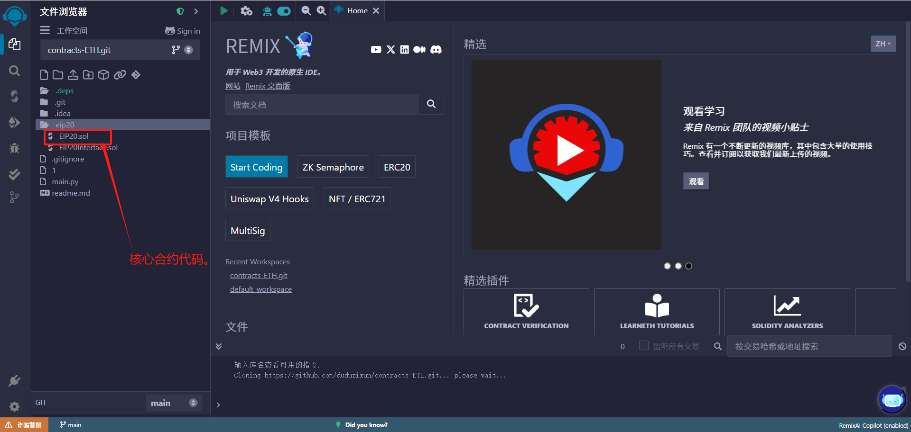

### 3、编译代码
    3.1、选择文件：`eip20/EIP20.sol`
    3.2、点击中间偏左上角的向右三角形：编译。
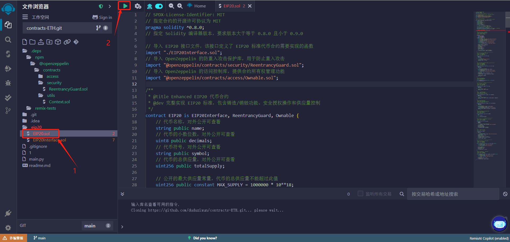

### 4、发布合约
#### 你好临时币：
    本小节目的：主要以体验整个发行过程。增加相关了解联系与学习。
    条件：会魔法上网即可完成下面任务与体验：：
    4.1、点击，编译，等于第三步操作（第3.1、3.2步）
    4.2、查看。状态需要是绿色的。
    4.3、点击，左侧的“部署和运行交易”。
    4.4、点击，选择环境：Remix VM(Cancun)
    4.5、点击，“部署”右边的向下 小按钮，对弹出的代币各参数进行配置。
        uint256 _initialAmount,         // 代币初始数量   比如填入：12345678901234567890
        string memory _tokenName,       // 代币名称（全称） 比如：dudu coin
        uint8 _decimalUnits,            // 代币精度  比如：10
        string memory _tokenSymbol      // 代币符号（简称） 比如：dudu
    4.6、点击，“部署”按钮，进行发布。
    4.7、查看，交易状态，是否成功。

    注：上面是发行代币为临时的，不是永久的，
        如果要永久测试币？
        解：1、申请到以太坊测试币，2、在MetaMask钱包(如：chrome MetaMask插件）。
            在上面的第4.4步，选择环境：Injected Web3（MetaMask），只要连接成功后，默认当前活动钱包地址就是发行者。
        
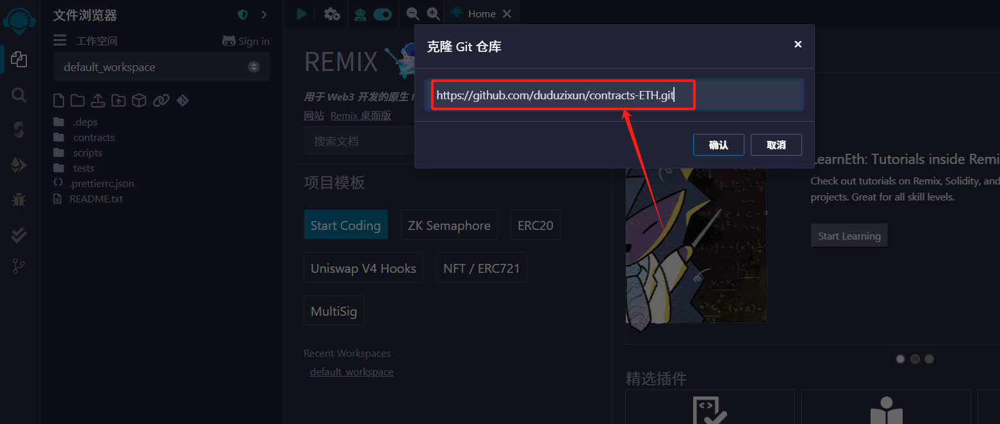
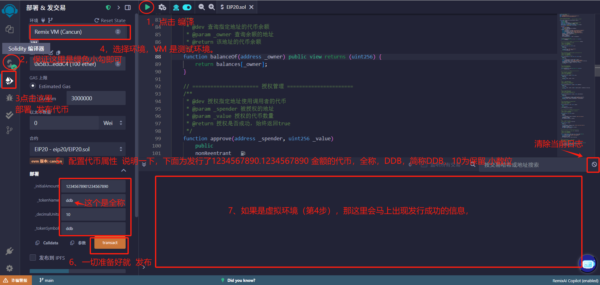
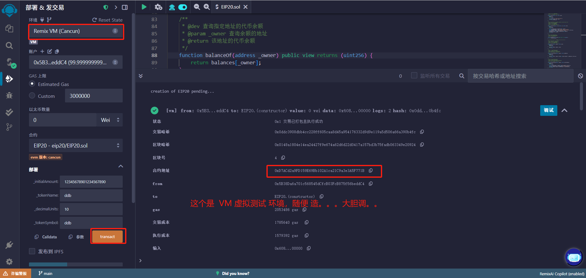

#### 你好永久币：
    下面是发行测试币与验证的步骤：
    本小节目的：主要以发行测试币与验证（包含主网络币，上链等操作）。
    条件：1、魔法上网，2、有测试币，3、有MetaMask钱包（含CHROME插件）
    步骤：
    B4.1、点击，编译，等于第三步操作（第3.1、3.2步）
    B4.2、查看。状态需要是绿色的。
    B4.3、点击，左侧的“部署和运行交易”。
    
在B4.3操作后，需要进行MetaMask钱包的连接操作，下面是连接操作步骤：
    1、chrome浏览器，安装MetaMask插件
    2、打开MetaMask插件（密码登录）。选择你有测试币 测试网络。
    3、选择有测试币的地址。

    下面截图为B4.4开始，前面的步骤看前面的截图即可
    B4.4，选择环境：Injected Provider - MetaMask ，CHROME会自动弹出MetaMask钱包，（请允许连接
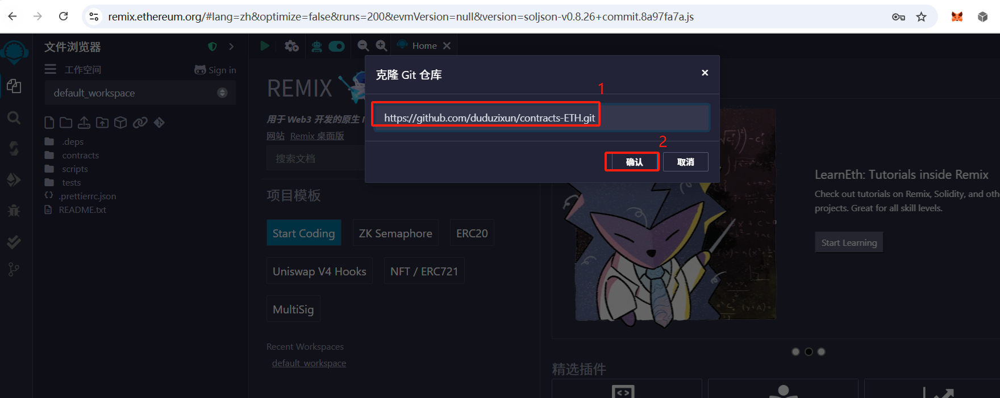
    
    选择当前活动钱包地址，点击“连接”按钮。
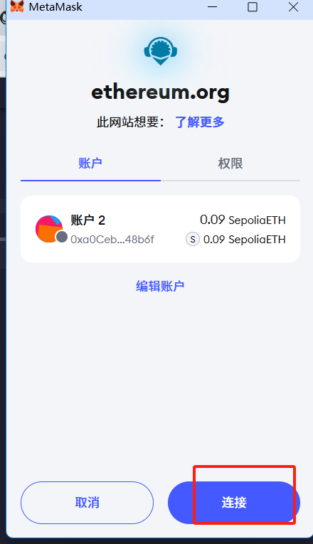
    
    检测是否有测试币
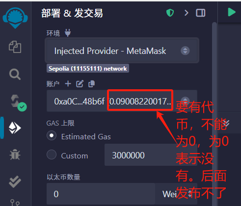
    
    连接好后，账户会显示你的账号情况，需要有测试币。
    B4.5、点击 transact 发布
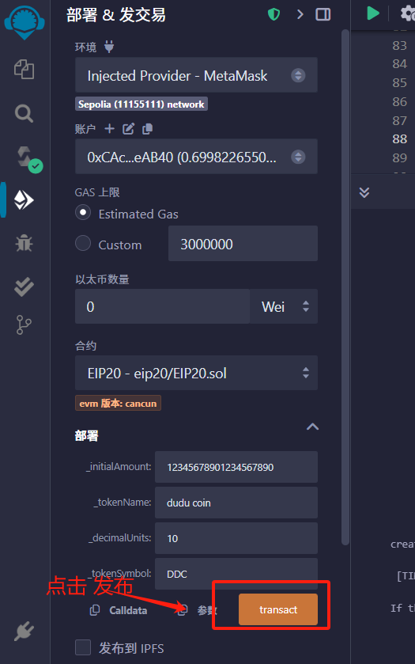
    小狐狸 插件自动弹出，点击“确认”按钮。
    【重要】，这里点了后就要花钱了，请重要这一步，，请注意。
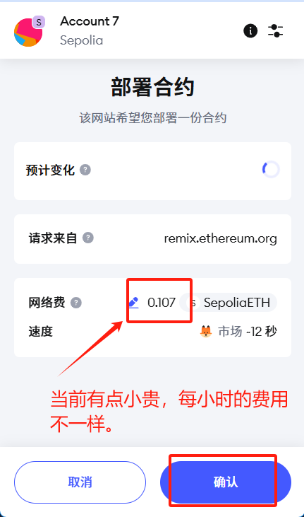
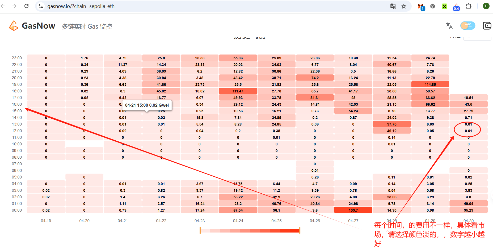

datetime: 2024-08-25 10:10:00

